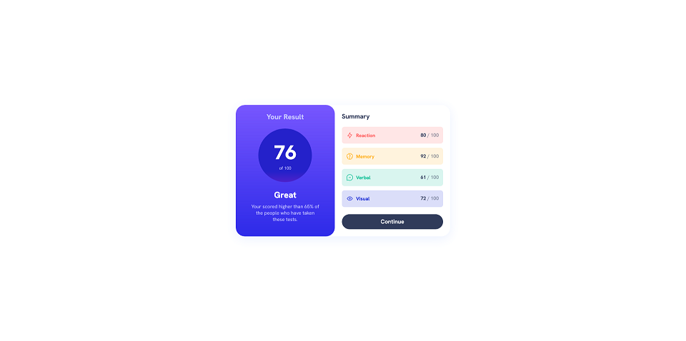
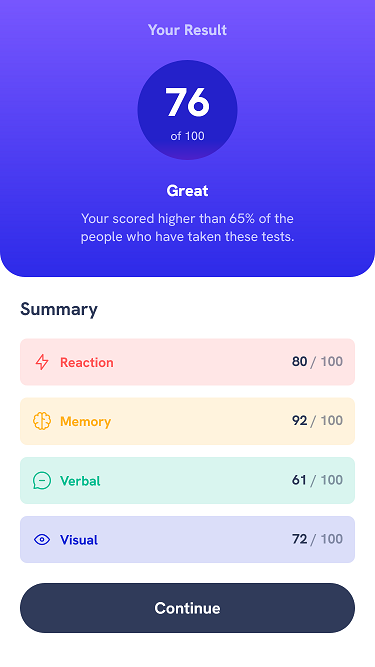

# Frontend Mentor - Results summary component solution

This is a solution to the [Results summary component challenge on Frontend Mentor](https://www.frontendmentor.io/challenges/results-summary-component-CE_K6s0maV). Frontend Mentor challenges help you improve your coding skills by building realistic projects. 

## Table of contents

- [Overview](#overview)
  - [The challenge](#the-challenge)
  - [Screenshot](#screenshot)
  - [Links](#links)
- [My process](#my-process)
  - [Built with](#built-with)
  - [What I learned](#what-i-learned)
  - [Useful resources](#useful-resources)
- [Author](#author)

## Overview

### The challenge

Users should be able to:

- View the optimal layout for the interface depending on their device's screen size
- See hover and focus states for all interactive elements on the page

### Screenshot





### Links

- Solution URL: [Solution]()
- Live Site URL: [Live Site]()

## My process

### Built with

- Semantic HTML5 markup
- CSS custom properties
- Flexbox
- Mobile-first workflow
- Svelte

### What I learned

Looping a data using Svelte framework

```js
<div class="attr-list">
    {#each attributes as value, index (index)}
        <AttributeItem item={value} />
    {/each}
</div>
```

### Useful resources

- [Svelte Documentation](https://svelte.dev/docs) - Documentation of Svelte framework
- [Import Font Files - I](https://www.pagecloud.com/blog/how-to-add-custom-fonts-to-any-website) - This helped me in importing downloaded fonts
- [Import Font Files - II](https://stackoverflow.com/questions/28279989/multiple-font-weights-one-font-face-query) - This helped in importing several font files but different font-weight

## Author

- Website - [Fidel Lim](https://fidellim-portfolio.netlify.app/)
- Frontend Mentor - [@fidellim](https://www.frontendmentor.io/profile/fidellim)
- Github - [@fidellim](https://github.com/fidellim)

